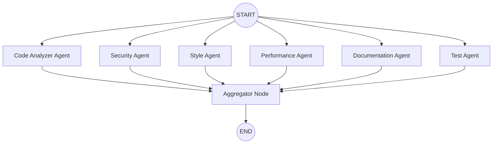

# 🚀 AutoCodeReview: AI-Powered Multi-Agent Code Review

AutoCodeReview is a modern, automated code review system that leverages **LangGraph** to orchestrate multiple specialized AI agents. It provides deep, parallel analysis of Python code, covering security, performance, style, and more.

## ✨ Key Features

- **Multi-Agent Orchestration**: Powered by **LangGraph**, agents run in parallel to provide a comprehensive review cycle.
- **Specialized Intelligence**: Distinct agents for Security, Performance, Style, Documentation, and Logic analysis.
- **High Performance**: Uses **Groq** for lightning-fast LLM inference.
- **Asynchronous Workflow**: Built with **FastAPI**, supporting background processing for large file reviews.
- **Automated Reporting**: Generates consolidated, deduplicated markdown reports of all findings.

---

## 🏗️ Architecture & LangGraph Workflow

The heart of the system is the `AgentOrchestrator`, which manages the execution of specialized agents using a directed acyclic graph (DAG).



### How it works:
1.  **Input**: A Python file is uploaded via the API.
2.  **Analysis Pipeline**: The file is pre-processed and metadata is extracted.
3.  **Parallel Execution**: LangGraph triggers all registered agents simultaneously. Each agent produces localized suggestions.
4.  **Aggregation**: The `Aggregator` node collects results, deduplicates overlapping findings, and compiles the final state.
5.  **Output**: A detailed Markdown report is generated and stored.

---

## 🛠️ Tech Stack

- **Framework**: [FastAPI](https://fastapi.tiangolo.com/)
- **Orchestration**: [LangGraph](https://langchain-ai.github.io/langgraph/)
- **LLM Provider**: [Groq](https://groq.com/)
- **Database**: SQLAlchemy + SQLite
- **Environment**: Python 3.10+

---

## 🚀 Getting Started

### 1. Prerequisites
- Python 3.10+
- A Groq API Key

### 2. Installation
```bash
git clone https://github.com/OmarMul/AutoCodeReview.git
cd AutoCodeReview
pip install -r requirements.txt
```

### 3. Configuration
Create a `.env` file in the root directory:
```env
GROQ_API_KEY=your_api_key_here
DATABASE_URL=sqlite:///./code_review.db
```

### 4. Running the Application
```bash
python -m src.main
```
The API will be available at `http://localhost:8000`. You can access the interactive docs at `/docs`.

---

## 📡 API Endpoints

| Method | Endpoint | Description |
| :--- | :--- | :--- |
| `POST` | `/api/v1/upload` | Upload a `.py` file for background review. |
| `GET` | `/api/v1/files` | List all uploaded files and their status. |
| `GET` | `/api/v1/files/{id}` | Get detailed report and content for a specific file. |
| `GET` | `/health` | Check system status. |

---

## 📄 License
This project is licensed under the MIT License.